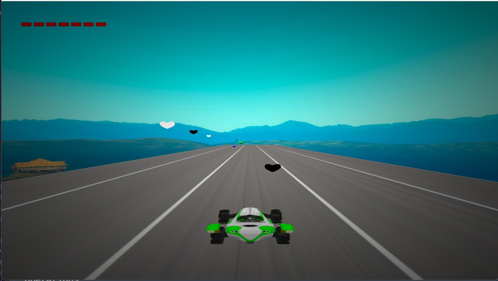

# XRacing Game 🏎🏎




## 📝 Table of Contents

* [About](#about)
* [Getting Started](#start)
* [How to play](#play)
* [Built Using](#build)
* [Demo and Screenshots](#demo)

### 📙About<a name = "about"></a>

🚩 XRacing is a 3d game in which to collect green hearts and avoid other hearts.You win when you collect 
  12 heart and lose when you lose all of your hearts

* it`s mainly coded in c++ and uses openGL for rendering
* it has 3d rendering system, collision detection system , text rendering system , lighting system and more ...

## 🏁Getting Started <a name = "start"></a>

```
Install Visual Studio Code.
```

```
Open the folder in Visual Studio Code.
```

```
Build the project.
```

```
Open a terminal (Terminal > New Terminal).
```

```
Run this Command ./bin/GAME_APPLICATION.exe -c="config/world.jsonc"
```

## 🎮How to play<a name = "play"></a>


* Press *🡹* or 🢃** to to move forward and backward.
* Use **🢀** to move left.
* Use **🢂** to move right.
* Use **space** to jump.


## 💻Built Using<a name = "build"></a>

* OpenGL

## 🎥 Demo<a name = "demo"></a>

<div name = "demo" align="center" width=1189>
  
<!--  -->
https://user-images.githubusercontent.com/59124058/172292519-c6ff90eb-978f-471b-b40c-d68b43472397.mp4


</div>


